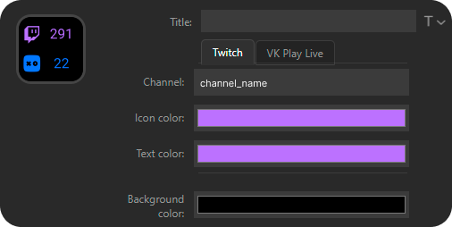

# sd-multiviewers-plugin

Плагин для Stream Deck, который показывает количество зрителей на стриме Twitch и VK Play Live в одной кнопке.

</img>

## Установка

В [разделе релизов](https://github.com/Chimildic/sd-multiviewers-plugin/releases) скачайте файл `ru.chimildic.multiviewers.streamDeckPlugin`. Запустите его и софт от Stream Deck автоматически установит плагин.
